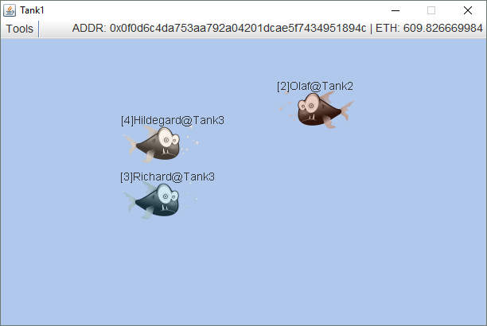

# AqualifeDApp
This is an implementation of the program 'Aqualife' as a distributed application for the ethereum network. The project is part of a Bachelor's thesis at the University of Applied Sciences in Konstanz ([HTWG](https://www.htwg-konstanz.de)).

## Overview

This project consists of a java application which uses a library to interact with an ethereum node and appropriate smart contracts. The program allows you to buy and trade `FishToken` in a very basic way. These `FishToken` can swim in the network between participating clients called `Tanks`. Each action is managed and controlled by three smart contracts, which depend on each other:

1. `FishBase`: Implements the ERC721 Non-Fungible Token standard partially. Responsible for holding `FishToken` and transferring ownership of them
1. `Broker`: Does the `FishToken` handoff (swimming), `Tank` registration and more
1. `Marketplace`: Responsible for buying (creating) and trading `FishToken`

## Install

At first, download the whole repository (ZIP file) or clone it with `git`. A properly installed java runtime ([JRE](https://java.com/de/download/)) is needed to execute the app. In addition, the following programs are necessary to run and build the project. To simply run the application on the public testnet, you just need the ethereum node `geth`. Make sure that you can run each program in the console/terminal (e.g. add the programs to PATH on Windows).

| Program | Version | Description                                           | Download                                                  |
|---------|---------|-------------------------------------------------------|-----------------------------------------------------------|
| geth    | 1.8.12  | Ethereum node implemented in Go (CLI)                 | [here](https://ethereum.github.io/go-ethereum/downloads/) |
| solc    | 0.4.24  | Solidity compiler for smart contracts                 | [here](https://github.com/ethereum/solidity/releases)     |
| web3j   | 3.4.0   | Java library and CLI for generating contract wrappers | [here](https://github.com/web3j/web3j/releases)           |
| gradle  | 3.2.1   | Build tool for the java application                   | [here](https://gradle.org/install/)                       |
| python  | 3.7.0   | Programming language used for the utilities script    | [here](https://www.python.org/downloads/)                 |

## Run the application

To start the program, you need a running ethereum node and an account which holds some ether.
You can run the ethereum node either locally on a private test network or on the public ropsten test network (see below).
After that, you can run the java application located at `./jar/AqualifeDApp.jar` by double clicking or via the command `java -jar AqualifeDApp.jar` in the terminal. The java application will use the smart contract addresses specified in the file `./jar/contract_address.txt`. By default, these are the addresses of the contracts deployed on the public ropsten test network. This file will be overwritten if you deploy the contracts by your own.

First, start a terminal and change to the AqualifeDApp root directory. Type in the following commands:

### On Private Test Network

Use the utilities python script `aqualife.py` for setting up a private test network with `geth`.

1. Initialize a private blockchain and create some test accounts with some ether: `python aqualife.py init`
1. Run the private node locally: `python aqualife.py run`
1. Wait until the ethereum node starts to mine transactions. This may take a while (console output should be `mined potential block`).
1. Deploy the smart contracts on this blockchain (see chapter 'Deploy Smart Contracts').
1. Run the java application `AqualifeDApp.jar`.
1. The application will ask for your account (wallet file) and password (default: 'test'). The path to the wallet files is: `./test/ethereum/keystore`

### On Public Test Network (Ropsten)

1. Create an account: `geth --datadir ./test/ropsten --testnet account new`
1. Get some test ether via the [ropsten faucet](http://faucet.ropsten.be:3001/). Make sure that the queue is not full! You can check your balance e.g. on [etherscan](https://ropsten.etherscan.io/) by searching your address.
1. Run the ethereum node: `geth --datadir ./test/ropsten --testnet --syncmode "light" --rpc`
1. Wait until the block synchronization starts and until the node is up-to-date (console output should be `count=1`). 
1. Run the java application `AqualifeDApp.jar`.
1. The application will ask for your previously created account (wallet file) and password. The wallet file should be at `./test/ropsten/keystore`.

## Build

Run the command `python aqualife.py build` to build the project. This will do:

1. Compile smart contracts written in solidity with `solc`
1. Generate the java wrapper classes with the `web3j` command line tool
1. Compile the whole java project with `gradle` and create the executable jar file

Note: `gradle` needs a properly installed JDK. You can specify the JDK to be used in the `aqualife.py` script if any error occurs.

## Deploy Smart Contracts

First, make sure that an ethereum node is running (on private or public testnet, see above). The `AqualifeDApp.jar` contains also the functionality to deploy the smart contracts. To call this special class in the jar, execute the command `python aqualife.py deploy`. You will be asked for an account (wallet file) and a password. Some information windows will pop up when finished.